# Interface_automationplatform

# 接口测试平台
# python3.6.3 Django 2.0.2框架

## 系统声明：
---
1.本系统基于git开源项目进行初步学习web开发<br></br>
2.采用Django REST framework编写接口，前端页面采用比较容易上手的vue+elementUI<br>

## 使用方法：
---
### 1.安装Python3环境<br>
### 2.下载代码到本地并解压<br>
### 3.cmd到根目录下安装相关依赖包<br>

```bash
pip install -r requirements.txt<br>
pip install https://github.com/darklow/django-suit/tarball/v2
```
### 4.安装mysql数据库，配置数据库连接，进入api_automation_test/settings.py<br>
```python
DATABASES = {
    'default': {
        # 'ENGINE': 'django.db.backends.sqlite3',
        # 'NAME': os.path.join(BASE_DIR, 'db.sqlite3'),
        'ENGINE':'django.db.backends.mysql',     # 数据库类型，mysql
        'NAME':'api_test',            #  database名
        'USER':'root',               # 登录用户
        'PASSWORD':'123456',        #  登录用户名
        'HOST':'127.0.0.1',        # 数据库地址
        'PORT':'3306'              # 数据库端口
    }
}
```
### 5.cmd到根目录下，迁移<br>
```bash
python manage.py makemigrations
```
### 6.创造或修改表结构<br>
```bash
python manage.py migrate 
```
### 7.创建超级用户，用于登录后台管理<br>
```bash
python manage.py createsuperuser
```
### 8.安装VUE环境，下载node.js并配置环境，下载npm包管理器<br>
### 9.cmd进入frontend目录下，运行npm install安装相关依赖包<br>
### 10.打包<br>
```bash
npm run build
```
### 11.运行前端 
npm run serve

### 12.运行启动django服务<br>
```bash
python manage.py runserver
```
### 13.现在就可以访问 http://localhost:8080/login 进行登录， http://127.0.0.1:8000/admin 为后台管理平台<br>

## 系统图解
----
1、登录页面，只提供了登录方法，并没有注册和忘记密码功能，账号由后台管理系统直接创建分配<br>
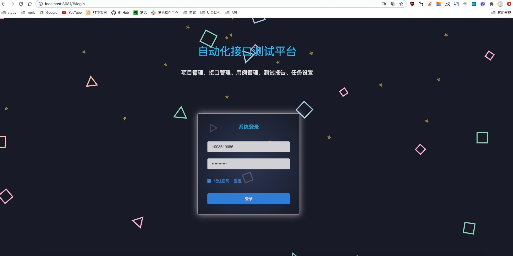<br>
<br>
2、目前只开放了接口测试，所有只有项目列表页面，可完成项目的新增，删除，查询，修改，批量删除<br>
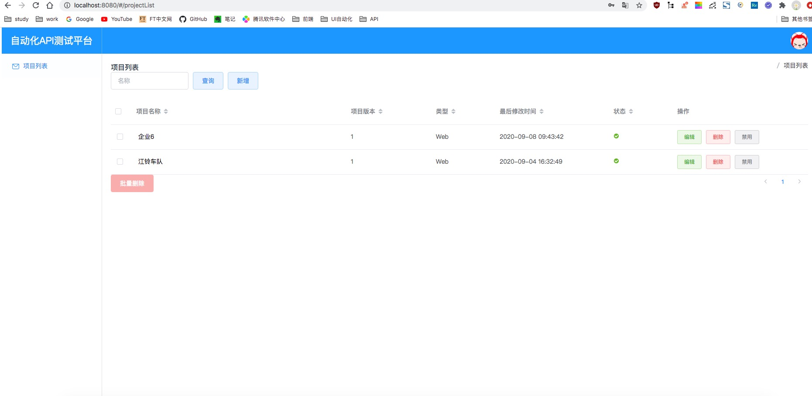<br>
<br>
3、新增项目<br>
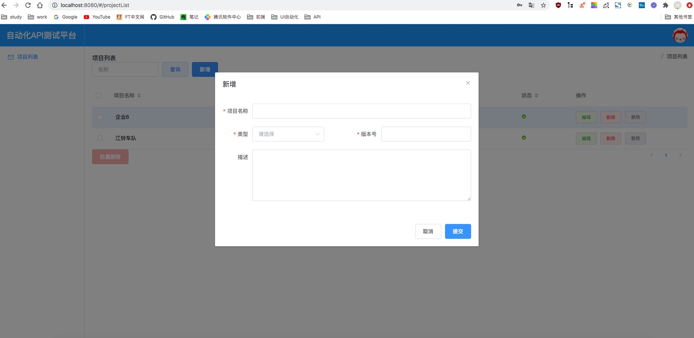<br>
<br>
4、点击项目名称后，进入项目概况界面，总的展示一些项目的基本情况<br>
<br>
<br>
5、HOST配置页面，提供了，增删改查，批量修改HOST，作为执行自动化测试时的全局变量<br>
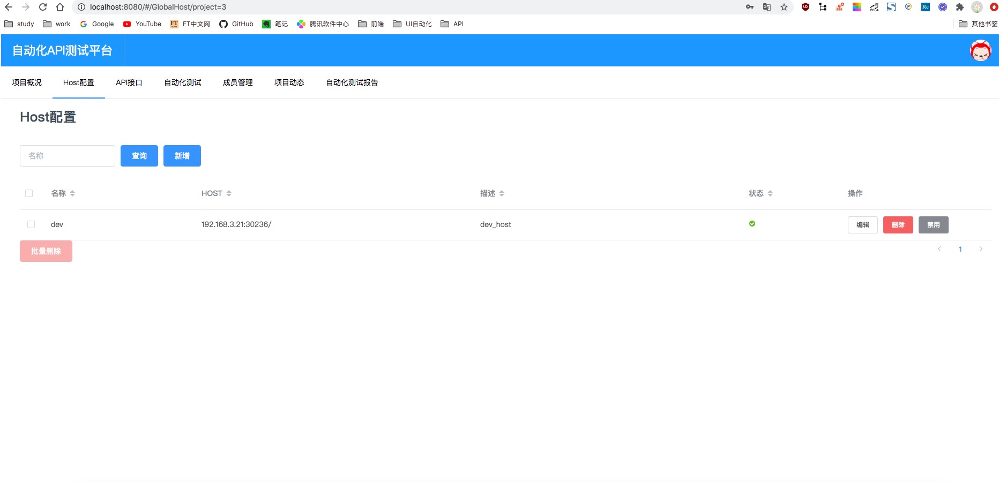<br>
<br>
6、API页面，可执行快速测试，类似于postman，新增修改删除接口分组，新增修改删除项目接口<br>
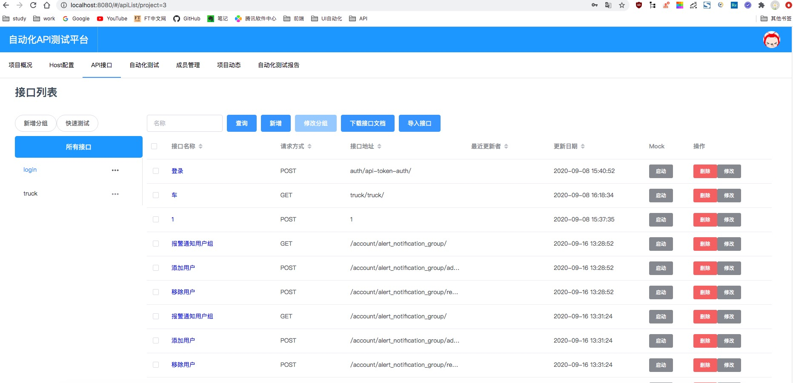<br>
<br>
7、快速测试界面，类似于postman的功能<br>
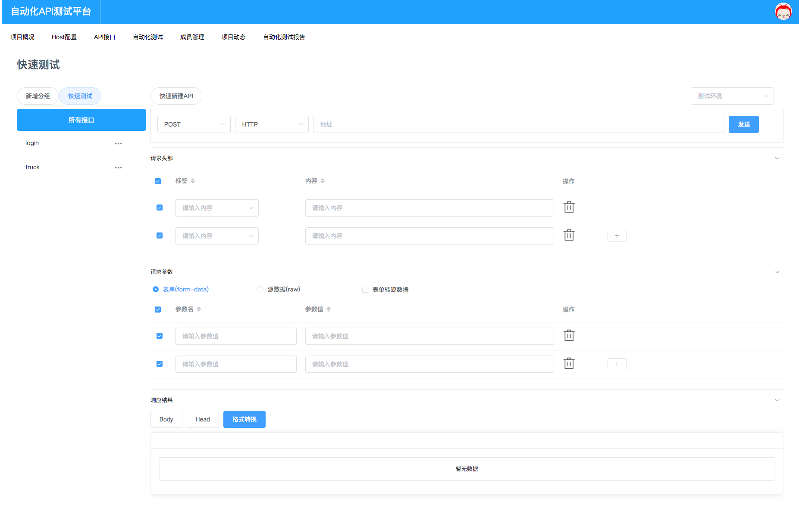<br><br>
8、新增接口分组，用于按模块对接口进行分类，更好的管理接口<br>
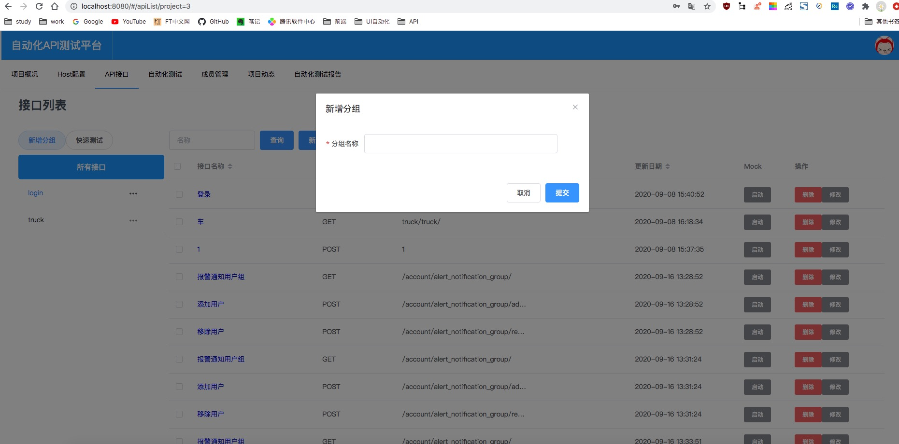<br><br>
9、新增API，用户可新增的API，目前只支持源数据格式和form-data格式<br>
<br><br>
11、接口详情界面，查看接口基本内容，可对接口进行测试，修改，删除，查看接口历史动态<br>
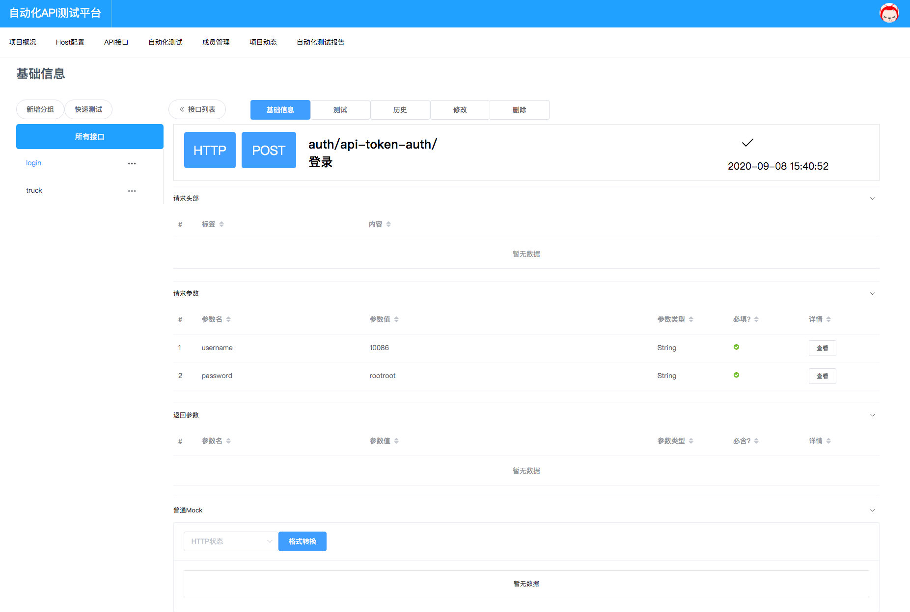<br>
13、自动化测试页面，实现自动化用例的分组，增删改查用例，并添加自动化定时任务定时任务<br>
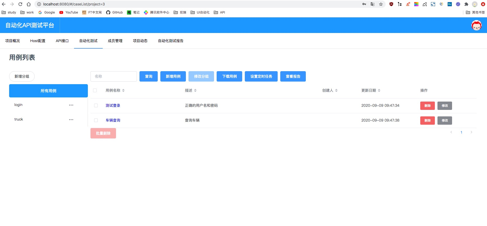<br><br>
15、用例下的接口列表，可添加用例接口，选择不同的环境测试接口，以及下载测试报告和设置定时任务<br>
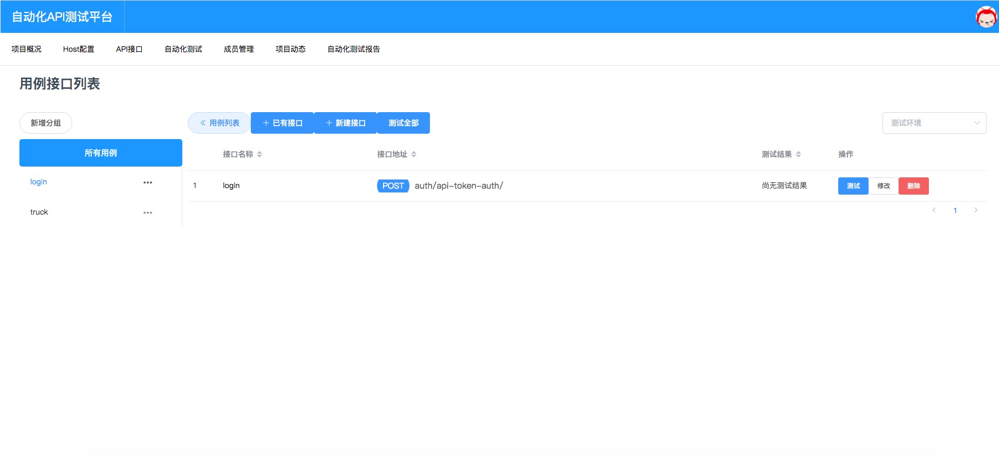<br><br>
16、用例下添加已有的接口，可添加在api模块中，已添加的接口，默认校验方式为不校验<br>
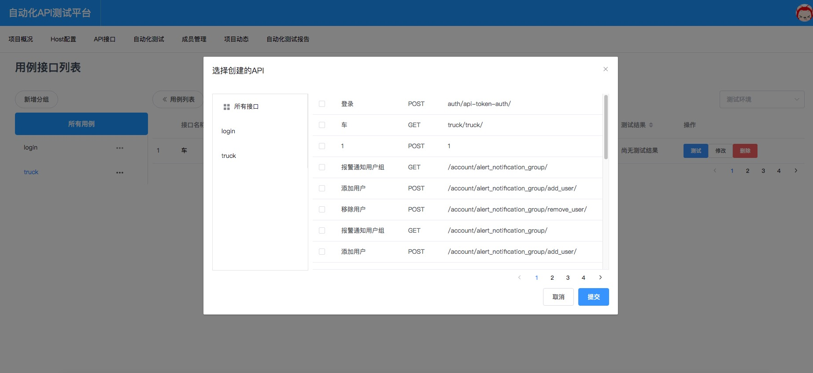<br><br>
17、项目成员，只做一个展示项目组成员页面，成员添加删除由后台管理操作，后续引入权限系统，分配权限角色<br>
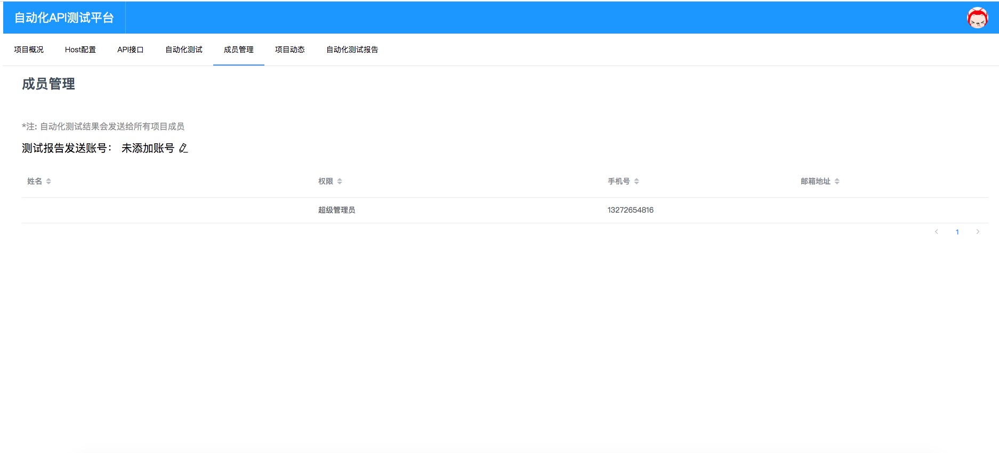<br>
<br>
18、展示项目三天内的动态情况<br>
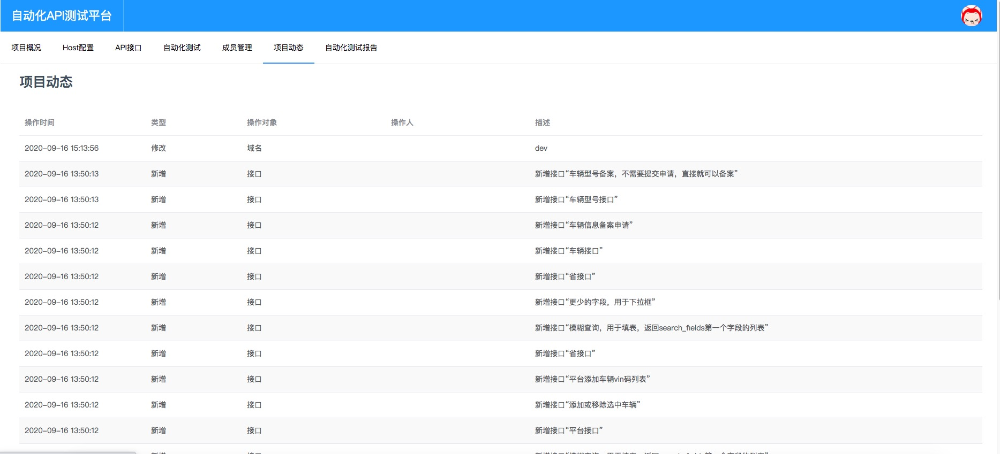<br>
<br>
18、自动化测试生成的报告，保留最近10次测试结果<br>
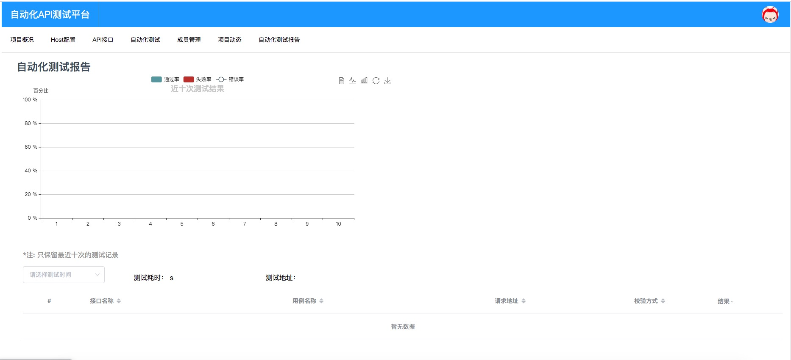<br>
<br>

21、后台管理页面，主要用作数据管理，及项目人员添加删除<br>
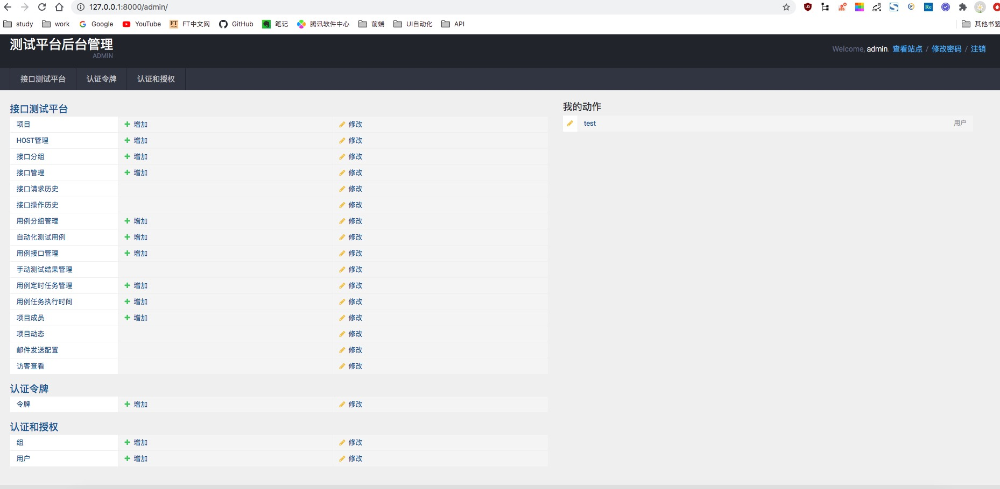
